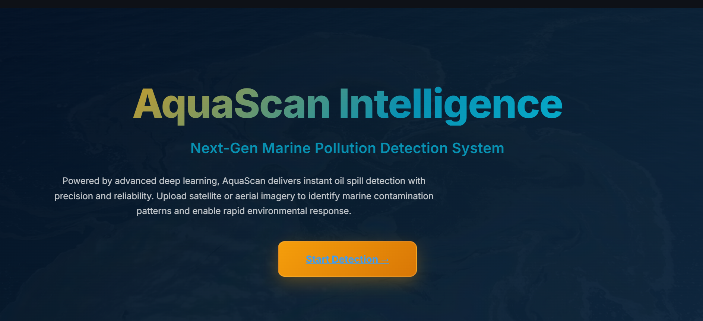
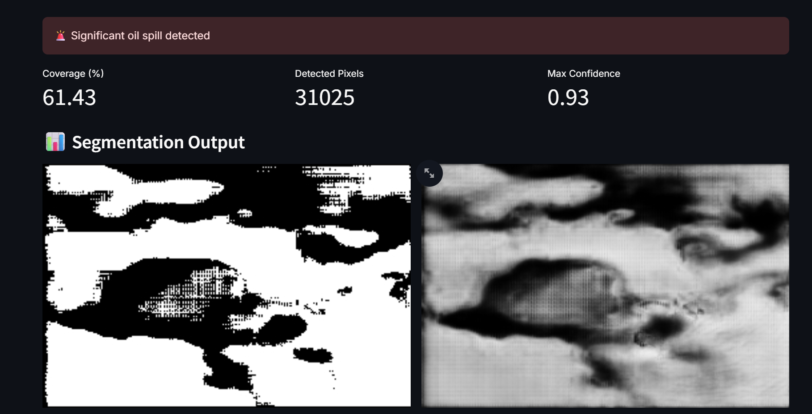

# 🛰️ AquaScan Intelligence - Oil Spill Detection System

An AI-powered marine oil spill detection application using deep learning segmentation. Upload satellite or aerial imagery to detect oil contamination with precision.


---

## 🌐 Live Demo

🔗 **Deployment Link:** [AquaScan Intelligence on Streamlit Cloud](https://your-app-name.streamlit.app)

> *Replace with your actual Streamlit Cloud URL after deployment*

---

## 🎬 Demo Video

https://github.com/user-attachments/assets/YOUR_VIDEO_ID

> *Upload your screen recording to GitHub: Drag and drop the video file into any GitHub issue or PR comment, then copy the generated URL here*

---

## 📸 Screenshots

### Main Interface


### Segmentation Output


---

## 🎯 Project Overview

AquaScan Intelligence is a computer vision application designed to detect and segment oil spills in marine environments using satellite and aerial imagery. The system uses a **U-Net based deep learning architecture** trained on oil spill datasets to perform semantic segmentation.

### Key Features

- 🔍 **Real-time Oil Spill Detection** - Upload images and get instant results
- 🎨 **Binary Mask Generation** - Visual segmentation of detected oil regions
- 📊 **Confidence Mapping** - Probability heatmap showing detection confidence
- 📈 **Metrics Dashboard** - Coverage percentage, detected pixels, and confidence scores
- 🌐 **Web-based Interface** - Easy-to-use Streamlit frontend

---

## 🏗️ Architecture

### Model: Enhanced U-Net

The model uses an **Enhanced U-Net architecture** optimized for oil spill segmentation:

```
Input (256x256x3) 
    ↓
[Encoder] - 4 downsampling blocks with Conv2D + BatchNorm + ReLU
    ↓
[Bottleneck] - 1024 channels
    ↓
[Decoder] - 4 upsampling blocks with skip connections
    ↓
Output (256x256x1) - Binary segmentation mask
```

### Tech Stack

| Component | Technology |
|-----------|------------|
| **Deep Learning** | PyTorch 2.0+ |
| **Model Architecture** | Enhanced U-Net |
| **Frontend** | Streamlit |
| **Image Processing** | PIL, NumPy |
| **Model Hosting** | Hugging Face Hub |

---

## 📁 Project Structure

```
oilspill/
├── streamlit_app.py          # Main Streamlit application
├── requirements.txt          # Python dependencies
├── config/
│   └── config.py             # Configuration settings
├── models/
│   ├── model_architecture.py # PyTorch U-Net model definition
│   └── best_model.pth        # Trained model weights (downloaded from HF)
├── utils/
│   ├── inference.py          # Model inference pipeline
│   ├── preprocessing.py      # Image preprocessing utilities
│   └── visualization.py      # Visualization helpers
├── styles/
│   └── custom.css            # Custom styling
└── .streamlit/
    └── config.toml           # Streamlit configuration
```

---

## 🚀 Getting Started

### Prerequisites

- Python 3.9 or higher
- pip package manager

### Local Installation

1. **Clone the repository**
   ```bash
   git clone https://github.com/YOUR_USERNAME/oil-spill-detection.git
   cd oil-spill-detection
   ```

2. **Create virtual environment**
   ```bash
   python -m venv .venv
   .venv\Scripts\activate  # Windows
   # or
   source .venv/bin/activate  # Linux/Mac
   ```

3. **Install dependencies**
   ```bash
   pip install -r requirements.txt
   ```

4. **Run the application**
   ```bash
   streamlit run streamlit_app.py
   ```

5. **Open in browser**
   ```
   http://localhost:8501
   ```

> **Note:** The model weights (~375MB) will be automatically downloaded from Hugging Face on first run.

---

## 📊 Model Performance

| Metric | Value |
|--------|-------|
| Input Size | 256 × 256 pixels |
| Output | Binary segmentation mask |
| Confidence Threshold | 0.5 |
| Model Size | ~375 MB |

---

## 🖼️ How to Use

1. **Upload Image** - Click the upload button and select a satellite/aerial image (JPG, PNG)
2. **Detect** - Click "🚀 Detect Oil Spill" button
3. **View Results** - See the binary mask, confidence map, and detection metrics

### Supported Image Types
- Satellite imagery (optical)
- Aerial photographs
- SAR (Synthetic Aperture Radar) images
- Standard JPG/PNG formats

---

## 🔧 Configuration

Key settings in `config/config.py`:

```python
IMG_HEIGHT = 256
IMG_WIDTH = 256
CONFIDENCE_THRESHOLD = 0.5
MAX_FILE_SIZE = 10  # MB
```

---

## 📦 Dependencies

```
streamlit>=1.28.0
torch>=2.0.0
torchvision>=0.15.0
numpy>=1.24.0
opencv-python-headless>=4.8.0
Pillow>=10.0.0
requests>=2.28.0
```

---

## 🤝 Contributing

Contributions are welcome! Please feel free to submit a Pull Request.

---

## 📄 License

This project is licensed under the MIT License - see the [LICENSE](LICENSE) file for details.

---

## 🙏 Acknowledgments

- Model hosted on [Hugging Face Hub](https://huggingface.co/a-nema/oil-spill-model)
- Built with [Streamlit](https://streamlit.io/)
- Powered by [PyTorch](https://pytorch.org/)

---

## 📧 Contact

For questions or feedback, please open an issue on GitHub.

---

<p align="center">
  <b>AquaScan Intelligence</b> — Protecting Oceans with AI 🌊
</p>
